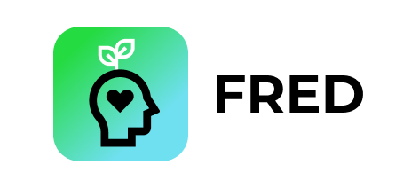

# Mental-Health

Visit our website: http://a.fredthefriendlyfrog.tech/
- source: https://github.com/wyang342/Mental-Health

*Fred* is an Android application and an android (noun) companion built for the ups and downs of your mental health. Sign up, log in, and we'll introduce you to our amphibian mascot, Fred the Friendly Frog, whose passion is boosting your morale. Check out your profile page when you get a chance—you can select your current mood and Fred will offer insight on your mental health, along with tips on how to improve it.

Built with: dialogflow,figma,firebase,google-cloud,html5,css3,kotlin

Benevolent creators: [Edward](https://www.github.com/edwardlee) [Pujith](https://www.github.com/pkachana3) [Rutvik](https://www.github.com/RutvikJ77) [Won](https://www.github.com/wyang342)
